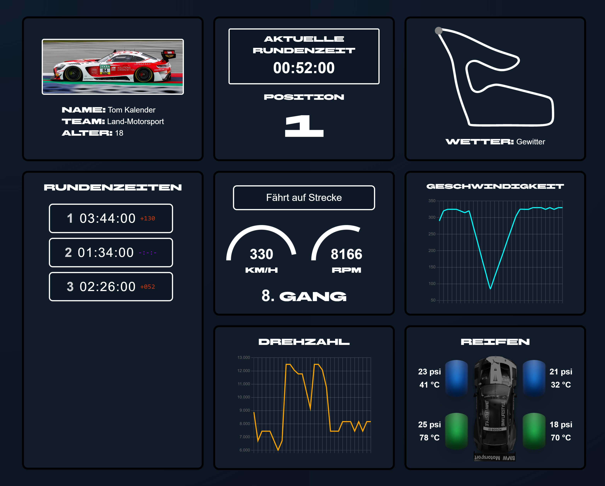

# C#-BLAZOR-ApexView-Racecar Dashboard

🏎️ A school project featuring a real-time motorsport dashboard built with Blazor. Tracks 20 cars with live lap times, positions, speed, RPM, gears, telemetry charts, tyre simulation (pressure/temp), and immersive crash/podium overlays.

> ⚠️ **Note on responsive Design:** This dashboard is custom-built and optimized exclusively for standard laptop and some desktop monitors to display the extensive telemetry grid. It is **not** designed for mobile devices, tablets, very small screens and some desktop monitors, where layout scaling may distort.

## Features

- **20-Car Grid Selection:** Switch between 20 different DTM drivers via an interactive dropdown menu to update the telemetry in real time.
- **Live Positioning & Lap Times:** Automatically calculates live positions based on track progress and records detailed lap histories with color-coded time deltas.
- **Dynamic Physics Simulation:** Simulates speed, engine RPM, and gears (1-8) based on track sections (straights vs. corners).
- **Advanced Tyre Monitor:** Tracks pressure (psi) and temperature (°C) for each tyre individually, where optimal temperatures directly boost car performance.
- **Live Analytical Charts:** Features rolling line graphs and canvas gauges that animate speed and RPM data in real time.
- **Immersive Race Overlays:** Displays conditional full-screen overlays for race incidents (minor/severe crashes) and a final podium screen when the race finishes.

## Card Descriptions

- **Driver Information Card:** Displays the selected driver's car photo, name, team, and age, combined with an interactive dropdown to switch between all 20 cars.
- **Stopwatch & Position Card:** Shows the current live lap timer alongside the driver's current position in the race.
- **Circuit & Weather Card:** Visualizes the track map (Red Bull Ring) with a dynamic dot tracking the car's current section, plus a live weather status indicator.
- **Lap Times Card:** Lists all completed lap times for the selected car, highlighting the personal best lap and calculating deltas to it.
- **General Telemetry Card:** Displays active race flags alongside live digital readouts and canvas gauges for Speed ($km/h$), RPM ($rpm$), and the current Gear.
- **Speed & RPM Chart Cards:** Uses rolling line charts to visualize the historical telemetry data of the vehicle's speed and engine torque over time.
- **Tyre Monitor Card:** Features a visual top-down graphic of the chassis showing live pressure and temperature for all four tyres, color-coded by their current grip efficiency.

## Technical Notes

- Built as a component-based web application using Blazor WebAssembly/Server.
- Utilizes an asynchronous backend ticking service (`RepeatingTaskService`) to drive the simulation logic every second.
- Uses Blazor JSInterop to seamlessly connect C# backend logic with frontend JavaScript canvas gauges and Chart.js libraries.
- Features automatic C# data modeling for realistic tyre heating/cooling and random race incidents (engine failures, driver mistakes, crashes).

### Technologies Used:

- C# (.NET / Blazor)
- JavaScript (JSInterop / Chart.js)
- HTML5
- CSS3 (Bootstrap & Custom Grid Layouts)

## Preview

## About

Created by Florian Heinreichsberger and Manuel Amberger, students at a technical high school (HTL) in austria.
